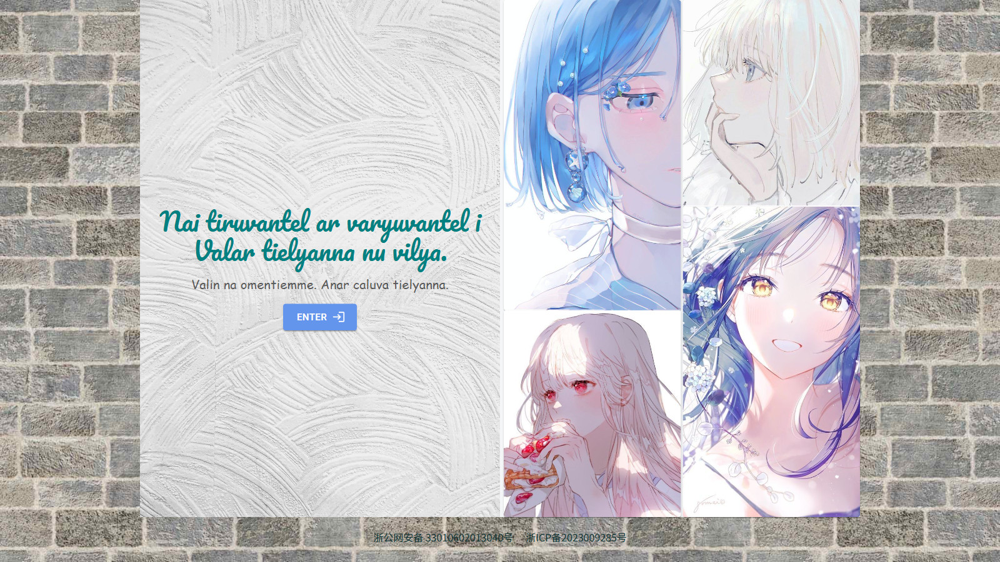
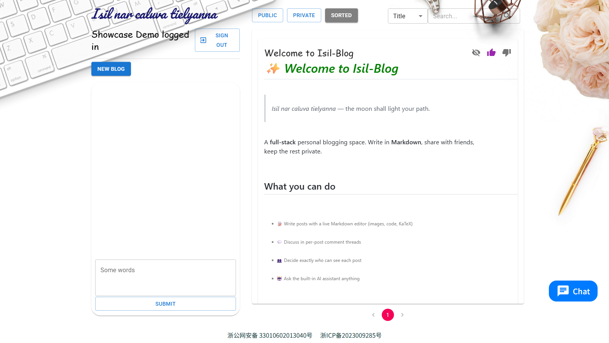
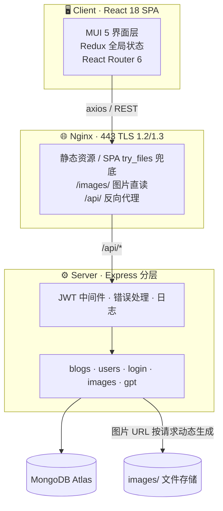

<div align="center">

# 🌙 Isil-Blog

*Nai tiruvantel ar varyuwantel i Valar tielyanna nu vilya.*
*—— 愿诸神护佑你通往西土的旅途*

**一个 React 18 + Express + MongoDB 的全栈个人博客系统**

[](https://react.dev)
[](https://expressjs.com)
[](https://www.mongodb.com/atlas)
[](https://mui.com)
[](https://jwt.io)
[](LICENSE)

[功能特性](#-功能特性) · [系统架构](#-系统架构) · [技术栈](#-技术栈) · [项目结构](#-项目结构) · [快速开始](#-快速开始) · [线上部署](#-线上部署) · [设计决策](#-设计决策) · [Roadmap](#-roadmap)

**线上访问：** [www.mistysakura.top](https://www.mistysakura.top)

| 🏠 首页 | 🔐 登录 | 📝 博客 |
|:---:|:---:|:---:|
|  |  |  |

</div>

## ✨ 功能特性

| | 功能 | 说明 |
|:---:|---|---|
| 🌸 | 沉浸式首页 | 昆雅语（Quenya）欢迎语 + 动态图片墙， Tolkien 风格视觉设计 |
| 📝 | Markdown 创作与渲染 | 基于 `@uiw/react-md-editor` + `react-markdown`，支持标题 / 引用 / 列表 / 代码块 / 表格 / KaTeX 数学公式 |
| 🖼️ | 图片上传与管理 | 编辑器内置自定义图片命令，URL 按请求动态生成，本地与线上零配置通用 |
| 🔐 | JWT 认证 | 注册 / 登录 / 60 分钟令牌，路由级保护，`bcryptjs` 密码哈希 |
| 👁️ | 博客可见性白名单 | 每篇博客可指定「仅某些用户可见」，未授权用户在列表中不可见 |
| 💬 | 评论系统 | 登录用户对博客实时评论 |
| 🤖 | AI 客服 | 集成 OpenAI 接口的全站智能问答 |
| 🚀 | 工程化脚本 | `scripts/dev.ps1` 本地一键启动 · `deploy/deploy.sh` 服务器一键部署（pm2 + nginx + HTTPS） |
| 📱 | 响应式 UI | Material Design 3 风格，MUI 5 组件体系 |

## 🏗️ 系统架构



- **前端**只与 `/api/*` 通信，图片走 nginx `/images/` 静态直读，不占用后端资源
- **后端**按 `config / db / models / controllers / middleware / utils` 分层，`express-async-errors` 统一异步错误处理
- **数据库**托管于 MongoDB Atlas，连接串走环境变量（非 SRV 标准连接，规避路由器对 SRV 的 DNS 负缓存）

## 🛠️ 技术栈

**前端 Frontend**

| 技术 | 用途 |
|---|---|
| React 18 + CRA 5 | 组件化视图层 |
| Redux | 登录态 / 博客列表 / 通知的全局状态 |
| MUI 5 + Emotion | Material Design UI 体系 |
| React Router 6 | SPA 路由 |
| axios | 统一封装的接口层（`src/api/`） |
| @uiw/react-md-editor | Markdown 编辑器（含自定义图片命令） |
| react-markdown + KaTeX | 正文渲染与数学公式 |
| openai | AI 客服 |

**后端 Backend**

| 技术 | 用途 |
|---|---|
| Node.js + Express 4 | REST API 服务 |
| Mongoose 7 | MongoDB ODM（blog / user 模型） |
| jsonwebtoken | 签发与校验 JWT（60 分钟） |
| bcryptjs | 密码哈希 |
| multer | 图片上传落盘 |
| express-async-errors + 自定义错误中间件 | 统一错误出口 |

**运维 DevOps**

| 技术 | 用途 |
|---|---|
| nginx | HTTPS（仅 TLSv1.2/1.3）、静态资源、反向代理 |
| pm2 | 后端进程守护 |
| PowerShell / Bash 脚本 | `dev.ps1` 本地启动、`deploy.sh` 幂等部署 |

## 📁 项目结构

```
Isil-Blog/
├── client/                     # 前端 (React 18 + CRA + MUI + Redux)
│   ├── public/                 # 静态资源（背景图、favicon、token.txt）
│   ├── src/
│   │   ├── api/                # 接口层（axios 封装：blogs / users / login / images / gpt）
│   │   ├── components/         # 通用组件（Blog、Comment、LoginForm、Dialog…）
│   │   ├── pages/              # 页面（HomePage / LoginPage / BlogPage）
│   │   ├── utils/              # 工具（formatDate、customImageCommand）
│   │   └── App.js              # 路由与全局状态
│   ├── .env.development        # 开发环境 API 地址 + 端口
│   └── .env.production         # 生产环境 API 地址（部署脚本按域名注入）
├── server/                     # 后端 (Node + Express + Mongoose)
│   ├── src/
│   │   ├── config/             # 环境变量集中读取
│   │   ├── db/                 # MongoDB 连接
│   │   ├── models/             # Mongoose 模型（blog、user）
│   │   ├── controllers/        # 控制器（blogs / users / login / images）
│   │   ├── middleware/         # JWT、日志、错误处理中间件
│   │   ├── app.js              # Express 应用与路由挂载
│   │   └── index.js            # HTTP 入口
│   └── .env                    # 连接串 / SECRET / 端口（不入库）
├── deploy/                     # 服务器部署套件（nginx 模板 + 一键脚本）
├── scripts/dev.ps1             # Windows 本地一键启动
└── docs/screenshots/           # README 截图
```

## 🚀 快速开始

> 环境要求：Node.js ≥ 16、MongoDB（本地或 Atlas 均可）

```bash
git clone https://github.com/Cappuccino-y/Isil-Blog.git
cd Isil-Blog
```

**1️⃣ 配置后端环境变量** —— 首次启动前，把 `server/.env.example` 复制为 `server/.env` 并填写：

| 变量 | 说明 |
|---|---|
| `MONGODB_URI` | MongoDB 连接串（Atlas 或本地） |
| `SECRET` | JWT 签名密钥 |
| `UPLOAD_DIR` | 图片目录（可选，不填走默认） |

**2️⃣ 一键启动**（自动装依赖、检查 `.env`、同时拉起前后端）：

```powershell
# Windows / PowerShell
.\scripts\dev.ps1
```

或手动：

```bash
npm install              # 根依赖（concurrently）
npm run install:all      # client + server 依赖
npm run dev              # 后端 :3001 + 前端 :3100
```

**3️⃣ 打开 http://localhost:3100** —— 注册账号即可开始写作 🎉

| 环境文件 | 用途 | 是否入库 |
|---|---|:---:|
| `server/.env` | 连接串、JWT SECRET、图片目录 | ❌ 本地自行创建 |
| `client/public/token.txt` | AI 客服 API Key（运行时读取） | ❌ |
| `client/.env.development` | 开发 API 地址 + 端口 | ✅ |
| `client/.env.production` | 生产 API 地址（构建兜底） | ✅ |

## 🌐 线上部署

服务器（Ubuntu + nginx）上全程非交互、可重复执行：

```bash
git clone git@github.com:Cappuccino-y/Isil-Blog.git && cd Isil-Blog/deploy
cp deploy.conf.example deploy.conf    # 按需修改域名 / 路径 / 端口
sudo bash deploy.sh
```

脚本自动完成：依赖安装 → 前端构建（按域名注入 API 地址）→ 静态资源同步与图片目录准备 → 生成 `server/.env` → pm2 守护后端 → 由 `nginx.conf.template` 生成配置并 `nginx -t` 校验（失败自动回滚）→ 重载 nginx。

相比旧版部署的关键改进：

- 80 端口 301 强制跳转 HTTPS
- SPA `try_files` 兜底（刷新非首页不再 404）
- 仅 TLSv1.2/1.3 + 现代 cipher 套件
- `/images/` alias 与后端 `UPLOAD_DIR` 对齐，旧图片链接不受影响
- `/api/` 反代补齐 `X-Forwarded-Proto`，后端可正确生成 https 图片 URL
- 文本资源 gzip 压缩

证书（`$DOMAIN.pem/.key`）提前放到 `deploy.conf` 指定路径（默认 `/etc/nginx/ssl/`）；每次改动只需重跑 `deploy.sh`，nginx 配置修改前自动备份。

## 🧠 设计决策

| 决策 | 理由 |
|---|---|
| Monorepo（根 `package.json` + concurrently） | `npm run dev` 一条命令拉起前后端，克隆即用 |
| 图片 URL 按请求动态生成 | 同一份代码在 localhost / 线上域名都能拿到正确图片地址，不再硬编码域名 |
| `blog.visible` 可见性白名单 | 细粒度隐私控制，未授权用户列表中直接不可见 |
| JWT 60 分钟有效期 | 在安全与「免频繁重登」体验间取平衡 |
| nginx 静态直读 `/images/` | 图片流量不经过 Node，降低后端压力 |
| 部署脚本幂等 + nginx 失败回滚 | 重复执行安全，改配置不至于把站点改挂 |

## 🗺️ Roadmap

- [ ] 评论楼层化 / 回复通知
- [ ] Markdown 代码高亮主题切换
- [ ] AI 客服流式输出
- [ ] Docker Compose 一键部署
- [ ] 服务端单元测试覆盖率提升（jest 已就位）

## 📄 License

[MIT](LICENSE) © Cappuccino-y
